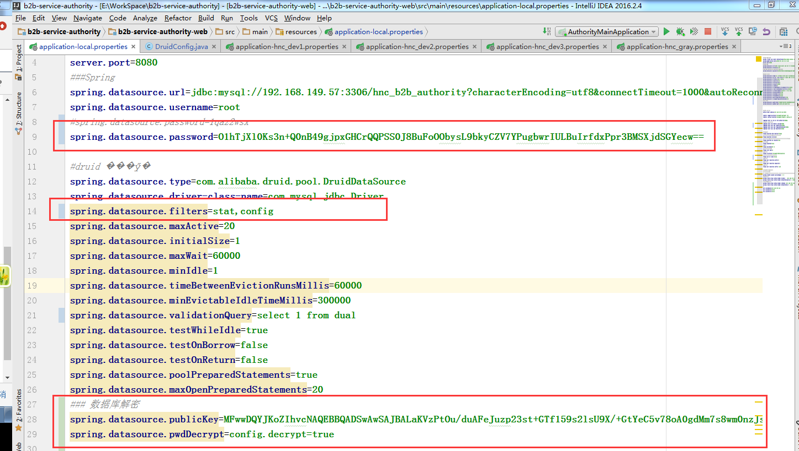
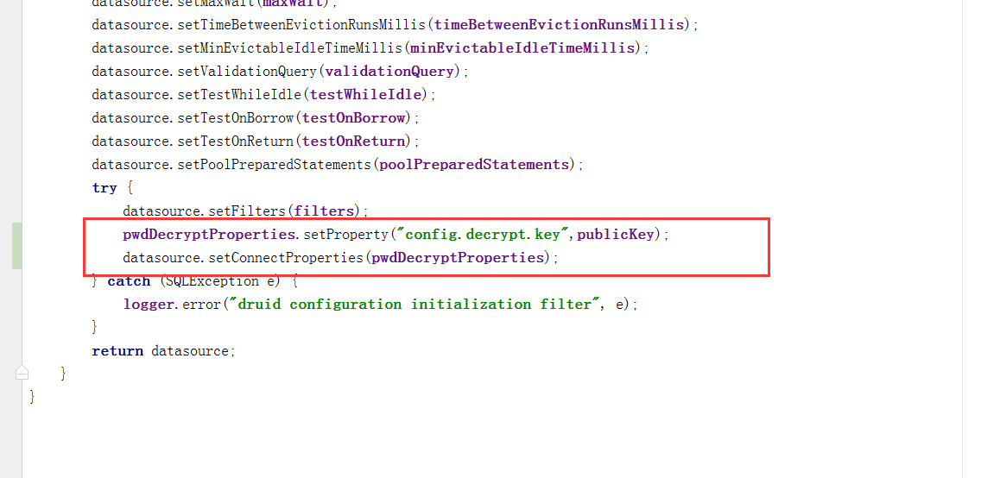
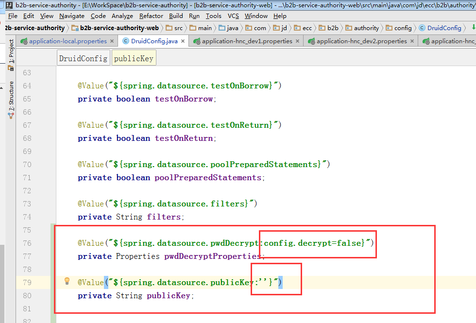

### 集成Druid---数据库密码加密解密
 
使用jar包版本：druid-1.0.29.jar

**明文密码+私钥(privateKey)加密=加密密码**

**加密密码+公钥(publicKey)解密=明文密码**

###### 1. 加密，用以下命令将密码加密
cmd命令行执行:

```
java -cp D:/druid-1.0.29.jar com.alibaba.druid.filter.config.ConfigTools 密码
```  

###### 2. 数据库配置

```
spring.datasource.password=O1hTjXl0Ks3n+Q0nB49gjpxGHCrQQPSS0J8BuFoOObysL9bkyCZV7YPugbwrIULBuIrfdxPpr3BMSXjdSGYecw==  
spring.datasource.filters=config  
## 新增配置：（目的：提示Druid数据源需要对数据库密码进行解密）
spring.datasource.publicKey=MFwwDQYJKoZIhvcNAQEBBQADSwAwSAJBALaKVzPtOu/duAFeJuzp23st+GTf159s2lsU9X/+GtYeC5v78oA0gdMm7s8wm0nzJsOtSyQWimm218q7Il01Hi0CAwEAAQ==
spring.datasource.pwdDecrypt=config.decrypt=true 
```  
  



###### 3. DruidConfig.java

```
## 注解属性设置初始值：目的：兼容密码明文，无需大改动代码
@Value("${spring.datasource.pwdDecrypt:config.decrypt=false}")
private Properties pwdDecryptProperties;

@Value("${spring.datasource.publicKey:''}")
private String publicKey;

（pwdDecryptProperties 包含两部分：1、config.decrypt：true  2、config.decrypt.key:公钥）
 pwdDecryptProperties.setProperty("config.decrypt.key",publicKey);
datasource.setConnectProperties（pwdDecryptProperties）;
```  


