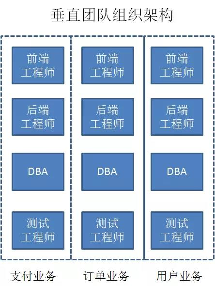

#### 微服务架构思想

微服务架构风格是一种将单个应用程序作为一套小型服务开发的方法，每种应用程序都在自己的进程中运行，并与轻量级机制（通常是HTTP资源API）进行通信。 这些服务是围绕业务功能构建的，可以通过全自动部署机制独立部署。 这些服务的集中管理最少，可以用不同的编程语言编写，并使用不同的数据存储技术。  

#### 微服务的特点
1. 独立部署，灵活扩展  
 传统的单体架构是以整个系统为单位进行部署，而微服务则是以每一个独立组件（例如用户服务，商品服务）为单位进行部署。  
2. 资源的有效隔离  
   微服务设计的原则之一，就是每一个微服务拥有独立的数据源，假如微服务A想要读写微服务B的数据库，只能调用微服务B对外暴露的接口来完成。这样有效避免了服务之间争用数据库和缓存资源所带来的问题。  
    同时，由于每一个微服务实例在Docker容器上运行，实现了服务器资源（内存、CPU资源等）的有效隔离。  
3. 团队组织架构的调整  
    

#### 微服务与面向服务架构SOA的区别  
> * SOA架构强调的是异构系统之间的通信和解耦合，而微服务架构强调的是系统按业务边界做细粒度的拆分和部署。  
  

#### 微服务的缺点  
> * 微服务把原来的项目拆分成多个独立工程，增加了开发和测试的复杂度  
> * 微服务脚骨需要保证不同服务之间的数据一致性，引入了分布式事物和一步补偿机制，为设计和开发带来一定挑战

#### 补充--》WSDL  
web service 描述语言 (WSDL) 是基于 XML 的语言，用于描述 web service 及其函数、参数和返回值。因为是基于 XML 的，所以 WSDL 既是机器可阅读的，又是人可阅读的，这将是一个很大的好处。一些最新的开发工具既能根据你的 web service 生成 WSDL 文档，又能导入 WSDL 文档，生成调用相应 web service 的代码。
